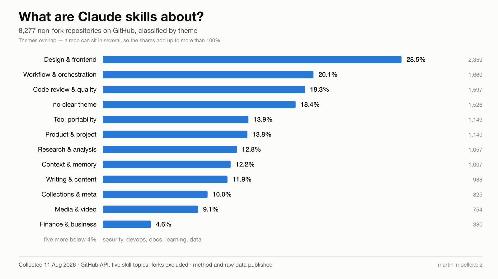

# What are Claude skills about?

_Collected 11 August 2026 · 8,277 non-fork repositories · method and raw data below_

Everyone is publishing skill collections. Nobody had measured what the field actually
contains. So I pulled the metadata and counted.

## The numbers

| Theme | Repos | Share |
|---|---:|---:|
| Design & frontend | 2,359 | 28.5% |
| Workflow & orchestration | 1,660 | 20.1% |
| Code review & quality | 1,597 | 19.3% |
| no clear theme | 1,526 | 18.4% |
| Tool portability (Codex, Cursor, Gemini) | 1,149 | 13.9% |
| Product & project | 1,140 | 13.8% |
| Research & analysis | 1,057 | 12.8% |
| Context & memory | 1,007 | 12.2% |
| Writing & content | 988 | 11.9% |
| Collections & meta | 825 | 10.0% |
| Media & video | 754 | 9.1% |
| Finance & business | 380 | 4.6% |
| Security | 351 | 4.2% |
| DevOps & infrastructure | 319 | 3.9% |
| Docs & technical writing | 309 | 3.7% |
| Learning & education | 301 | 3.6% |
| Data & databases | 213 | 2.6% |

Themes overlap: 2,439 repos fall into exactly one, 2,182 into two, 1,305 into three. The
shares therefore add up to well over 100%.

## Three things I did not expect

**The gold rush already peaked.** May 2026 saw 1,445 new skill repos. August is running at
roughly 755 for the month — about half. Before August 2025 the entire field consisted of 100
repositories.

**The unnoticed tail is not junk.** I sampled repos with zero stars expecting a different
population. Design & frontend: 28.5% there, 28.5% among starred repos. Identical. The tail is
the same field, just unread.

**The median repository has 2 stars.** In every single theme. The mean of 134 comes from a
handful of outliers.

## Method

Metadata only, via the GitHub API. Five topics — `claude-skill`, `claude-skills`,
`claude-code-skill`, `claude-code-skills`, `anthropic-skills` — deduplicated by full name,
because they overlap heavily. Sliced by star band, because the search API caps each query at
1,000 results; two oversized bands were split further by creation date. The zero-star bands are
the largest and were sampled at 810 repos rather than collected in full.

GitHub search excludes forks by default, so all 8,277 are independent repositories. A code
search for `SKILL.md` at repository root returns 35,392 files — the difference is the copy
layer.

**No `SKILL.md` was read.** A skill file is literally a prompt; reading thousands of them into
a model context is prompt injection at scale. This pass touches metadata only, so that risk is
zero. It also means the classification rests on names, descriptions and topics — not on what
the skills actually do.

## What this does not tell you

The theme categories are mine. They were built from a frequency count of the actual
descriptions rather than guessed in advance, but 18.4% still fall into none and multi-assignment
is heavy. Treat them as a useful heuristic, not a taxonomy.

Whether any of these skills contain techniques worth copying is a separate question that needs
the files themselves — with a sample, a fixed output schema, and the explicit rule that file
contents are data rather than instructions.

The field grows by roughly 750 repositories a month. This is a snapshot, and it says so in the
chart.

## Raw data and script

- [`assets/claude-skills-2026-08-11.jsonl`](assets/claude-skills-2026-08-11.jsonl) — one JSON
  object per repository
- [`assets/harvest.py`](assets/harvest.py) — the collector, about 60 lines, rerunnable

Rerun it and the numbers will differ. That is the point.
